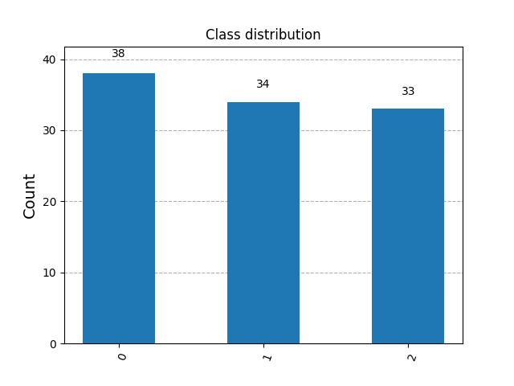
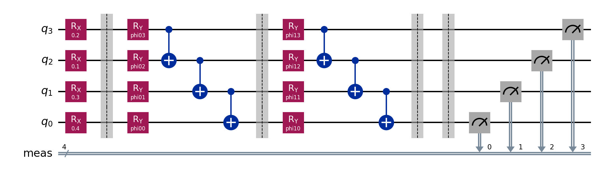
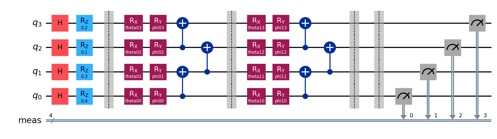
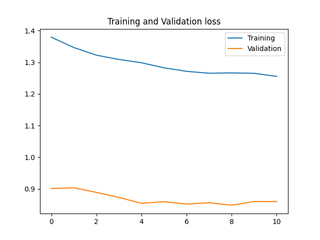

# Data exploration and pre-processing:

* We found out that we have the following dimension: 

* We have splitted the data into 60% training data, 20% validation data and 20% test data

* We chose to use angle encoding, and therefore we 
    scaled the data so every data point is larger or equal to zero and smaller or equal to pi.

# Circuits and models

Each model is derived from the `BaseModel` class.
The `BaseModel` class implements methods for fitting data, prediction, gradients and 
measuring circuits. All our circuits are only using 4 qubits.
Each model implements its own weight initialization, and its corresponding circuit.

## Circuit/Model 2: Real Amplitudes

The second circuit is the implementation of IBM's Real Amplitudes.
This uses a rotational encoding by Rx gates, and each subsequent layer 
contains Ry gates and entanglements(cx gates), followed up by full measurement.

## Measurement and Circuit output

When measuring, we apply the modulus operator on the number of classes.
Then sum up for each class and divide by the number of shots to get the probability for each class. 
That becomes the output of the model.

# Training

## Loss function

We are using cross-entropy loss(log_loss) as we are solving a classification problem.

## Gradient Descent

Our gradient descent function is just a standard stochastic gradient descent using
the finite difference method.

## Early stopping

## Model selection

For model selection we implemented random sampling of our hyperparameters.
Each is trained 4 times on randomly selected values and ran for maximum 20 epochs.
We select the model with the highest validation accuracy.

These are the sampling ranges used:

| Learning Rate | Epsilon | Layers(Model 2 and 3) |
| --------------- | --------------- | --------------- |
| 0.1 to 1 | 0.01 to 1 | 2 to 6 |

# Results

Chosen parameters:

| Model | Learning Rate | epsilon |
| --------------- | --------------- | --------------- |
| Model1 | 1.397 | 0.473 |

Performance(accuracy):

| Training | Validation | Test |
| --------------- | --------------- | --------------- |
| 33.33% | 90.00% | 96.67% |

What we learned:

Hardships:

* Long computation time 
* Gradient decent is slow
- Small dataset, easy to overfit to training data

