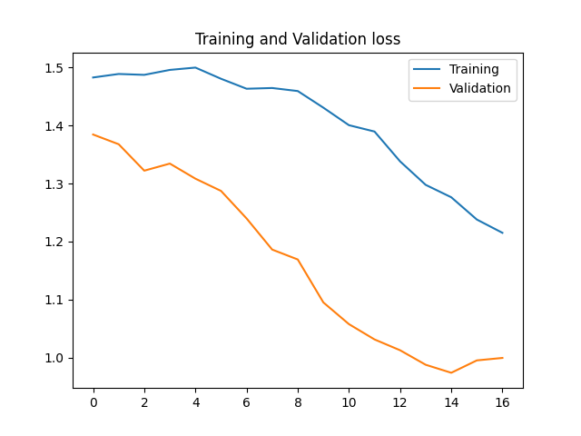

# Data exploration and pre-processing:

* We found out that we have the following dimension: 150,4
    150 samples with 4 datapoints each

* We have splitted the data into 70% training data, 15% validation data and 15% test data
    We then have 105 samples in the training data. We have in the training data samples 38, 34 and 33 of the respective target values 0, 1 and 2. 
    That will say we have a balanced dataset

* The feature value range is from 0.1 to 7.9 so we had to normalize.
    We did so and scaled it between 0 and pi with sklearn minmaxscaler before we encode it. 

* We chose to use angle encoding, and therefore we 
    scaled the data so every data point is larger or equal to zero and smaller or equal to pi.

# Circuits and models

Each model is derived from the `BaseModel` class.
The `BaseModel` class implements methods for fitting data, prediction, gradients and 
measuring circuits. All our circuits are only using 4 qubits.
Each model implements its own weight initialization, and its corresponding circuit.

## Circuit/Model 1: Quantum Convolutional Neural Network

The circuit has its inspirations from a traditional neural network. The unitary gates is somewhat simple, we could’ve used many more gates to make the model more complex, but since we don’t have much experience we went with “simple” unitary gates. 

Under the project we have tried to change between rz, rx, ry in this circuit, even tried to use u3 gates. The gates we think work, we get an ok result. The changes in gates didn’t feel like it impacted that much since the bigger elephant in the room was the parameters. 

Parameters start with random values from 0 to 2pi. Parameters together with epsilon value and learning rate seem hard to match. It looked like if it had a good start was very important, because the training got always stuck at some point. The model could wary between 20-70% accuracy without changes to the circuit. Later we found out that the learning rate and epsilon need to be in a certain area to be a bit more consistent.

We were not able to get this model to hit consistently 96% test accuracy, but it will often hit 85%, which we think is good. 

## Circuit/Model 2: Real Amplitudes

The second circuit is the implementation of IBM's Real Amplitudes.
This uses a rotational encoding by Rx gates, and each subsequent layer 
contains Ry gates and entanglements(cx gates), followed up by full measurement.

## Circuit/Model 3:

## Measurement and Circuit output

When measuring, we apply the modulus operator on the number of classes.
Then sum up for each class and divide by the number of shots to get the probability for each class. 
That becomes the output of the model.

# Training

## Loss function

We are using cross-entropy loss(log_loss) as we are solving a classification problem.

## Gradient Descent

Our gradient descent function is just a standard stochastic gradient descent using
the finite difference method.
For each gradient calculation we use 1000 shots. 

## Early stopping

## Model selection

For model selection we implemented random sampling of our hyperparameters.
Each is trained 4 times on randomly selected values and ran for maximum 20 epochs.
We select the model with the highest validation accuracy.

These are the sampling ranges used:

| Learning Rate | Epsilon | Layers(Model 2 and 3) |
| --------------- | --------------- | --------------- |
| 0.1 to 1 | 0.01 to 1 | 2 to 6 |

# Results

Chosen parameters:

| Model | Learning Rate | epsilon |
| --------------- | --------------- | --------------- |
| Model1 | 1.397 | 0.473 |

Performance(accuracy):

| Training | Validation | Test |
| --------------- | --------------- | --------------- |
| 33.33% | 90.00% | 96.67% |

## Observations

There are a few observations which affect our results:
- The dataset is small, so it is easy to overfit to training data.
    Additionally, if the model underfits it sometimes gets good validation 
    results as the sample size is small.
- Long training times due to gradient calculations, as we need
    to calculate the loss $2n$ times the number of parameters 
    a models has.

