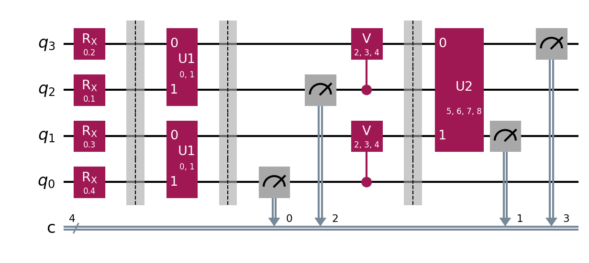

Data exploration and pre-processing:

* We found out that we have the following dimension: 

* We have splitted the data into 60% training data, 20% validation data and 20% test data

* We chose to use angle encoding, and therefore we 
    scaled the data so every data point is larger or equal to zero and smaller or equal to pi.

Loss function

* We use log_loss as out loss function since we have a classifier

Gradient Descent

Our gradient descent function is just a standard stochastic gradient descent using
the finite difference method.

Circuits

Choice of QNN

* We tried 3 curcuits:
    - Real amplitudes
    - Convolution Neural Network
    - A variation of Real Amplitudes

Underway results:
- Convolution Neural Network
    - good inital result, 100% accuracy on type 0, 1 but only 40% on 2
    - tried to change some gets from rx to rz or ry, reduced the accuracy heavly, but seemed that the learning ended to early

Selected model

What we learned:

Hardships:

* Long computation time 
* Gradient decent is slow

