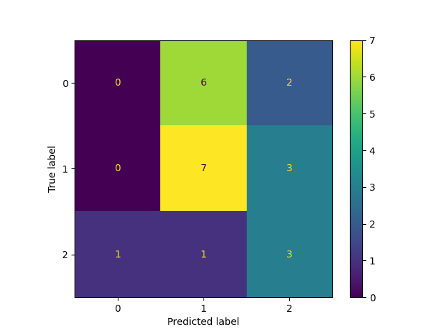

# Data exploration and pre-processing:

* We found out that we have the following dimension: 

* We have splitted the data into 60% training data, 20% validation data and 20% test data

* We chose to use angle encoding, and therefore we 
    scaled the data so every data point is larger or equal to zero and smaller or equal to pi.

# Circuits and models

Choice of QNN

* We tried 3 curcuits:
    - Real amplitudes
    - Convolution Neural Network
    - A variation of Real Amplitudes

In this circuit, I have created a variation of the "Real Amplitudes" ansatz with several customizations to enhance data representation and entanglement. I use Hadamard gates and $R_z$ rotations for feature encoding on each qubit, ensuring that input data is represented in the quantum states. In each layer, I’ve added both $R_x$ and $R_y$ rotations with adjustable parameters on each qubit, providing increased flexibility. Additionally, I expanded the entanglement pattern by including multiple CX gates between adjacent qubits, as well as an extra CX gate between qubits 1 and 2 in each layer. These modifications make the circuit more expressive and better suited to capture complex patterns in the data.

# Training

## Loss function

We are using cross-entropy loss(log_loss) as we are solving a classification problem.

## Gradient Descent

Our gradient descent function is just a standard stochastic gradient descent using
the finite difference method.

## Early stopping
I implemented early stopping to prevent overfitting and save computation time by stopping training when validation loss improvement stagnates. The mechanism uses a patience counter to allow minor fluctuations, incrementing if the validation loss doesn’t improve by min_delta within a set number of epochs. If the loss worsens by more than max_delta, training stops immediately. 

## Model selection

For model selection we implemented random sampling of our hyperparameters.
Each is trained 4 times on randomly selected values and ran for maximum 20 epochs.
We select the model with the highest validation accuracy.

| Learning Rate | Epsilon | Layers(Model 2 and 3) |
| --------------- | --------------- | --------------- |
| 0.1 to 1 | 0.01 to 1 | 2 to 6 |

# Results

Chosen parameters:

| Model | Learning Rate | $\epsilon$ |
| --------------- | --------------- | --------------- |
| Model1 | 1.397 | 0.473 |

Performance(accuracy):

| Training | Validation | Test |
| --------------- | --------------- | --------------- |
| 33.33% | 90.00% | 96.67% |

What we learned:

Hardships:

* Long computation time 
* Gradient decent is slow

